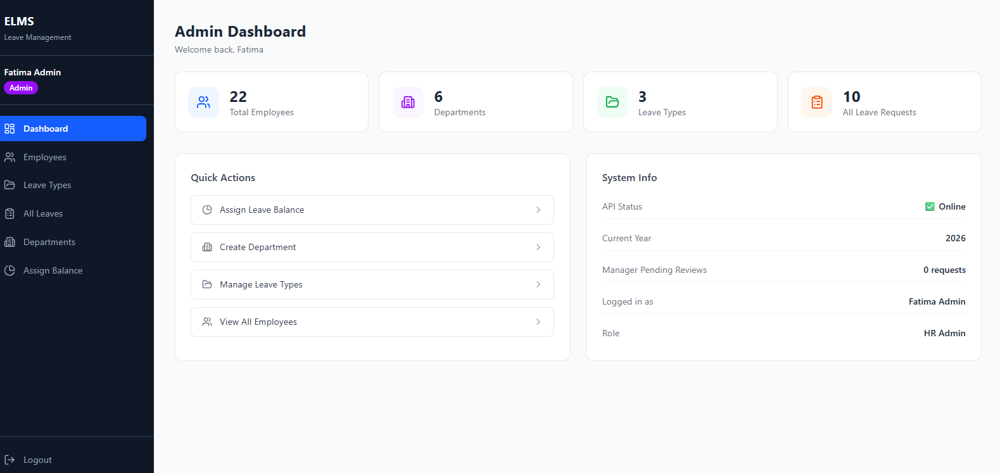

A full-stack HR leave management application built with **ASP.NET Core 8** (Clean Architecture) and **React 18** (Vite + Tailwind CSS). This project demonstrates real-world patterns used in enterprise software — JWT authentication, role-based authorization, approval workflows, AutoMapper, pagination, structured logging, and a fully responsive React frontend.

> ✅ **Status: Complete** — Backend (13 days) + Frontend (10 days) fully built and integrated.

---

## 📸 Admin Dashboard Preview

The HR Admin dashboard provides a centralized view for managing employees, leave requests, leave balances, departments, and leave types.



---

## 📌 Why This Project

Companies building enterprise software for banks, telecom, and government clients build HR modules like this constantly. This project mirrors that real-world domain — multiple user roles, an approval workflow, balance tracking, and business rules that go beyond simple CRUD. Built day-by-day and documented publicly on LinkedIn as a 30-day challenge.

---

## 🏗️ Architecture

### Backend — Clean Architecture

```
EmployeeLeaveMS.Domain          → Entities, Enums, Exceptions — zero external dependencies
EmployeeLeaveMS.Application     → Services, DTOs, Interfaces, AutoMapper profiles, Validation
EmployeeLeaveMS.Infrastructure  → EF Core, Repositories, JWT, BCrypt, Serilog
EmployeeLeaveMS.API             → Controllers, Middleware, Swagger
```

| Layer | Depends On |
|---|---|
| Domain | Nothing |
| Application | Domain only |
| Infrastructure | Domain + Application |
| API | Application + Infrastructure |

### Frontend — Feature-based Structure

```
src/
├── api/          → Axios instance, interceptors, API service functions
├── components/   → Reusable UI components (Button, Input, Alert, Sidebar, Layout)
├── context/      → AuthContext — global auth state with session verification
├── pages/        → auth/, employee/, manager/, admin/
├── routes/       → ProtectedRoute, GuestRoute
└── utils/        → tokenManager (in-memory access token, localStorage refresh token)
```

---

## 🛠️ Tech Stack

### Backend

| Concern | Technology |
|---|---|
| Framework | ASP.NET Core 8 |
| ORM | Entity Framework Core 8 |
| Database | SQL Server |
| Authentication | JWT + Refresh Tokens with rotation |
| Password Hashing | BCrypt.Net |
| Mapping | AutoMapper 16 |
| Logging | Serilog (console + daily rolling file) |
| Documentation | Swagger / Swashbuckle |
| Exception Handling | Global middleware + custom exception hierarchy |
| Validation | Data Annotations + ConfigureApiBehaviorOptions |

### Frontend

| Concern | Technology |
|---|---|
| Framework | React 18 + Vite |
| Styling | Tailwind CSS |
| Routing | React Router v6 |
| HTTP Client | Axios (with request/response interceptors) |
| State | useState + useEffect |
| Icons | Lucide React |
| Token Strategy | Access token in memory, refresh token in localStorage |

---

## ✨ Features

### Authentication & Security
- 🔐 JWT access tokens (15-minute expiry) + refresh token rotation (7-day)
- 🔄 Silent token refresh with concurrent request queuing (failedQueue pattern)
- 🚪 Session verification on every app load — stale tokens cleared automatically
- 🛡️ Role-based authorization — Employee, Manager, HR Admin
- 🔒 Access token stored in memory only (XSS protection)

### Leave Management
- 📝 Leave application with weekend-aware working day calculation
- ✅ Manager approval/rejection workflow with mandatory rejection comments
- 💰 Atomic balance deduction on approval (UnitOfWork pattern)
- 🚫 Overlap detection — cannot apply for conflicting date ranges
- ❌ Cancel pending requests before approval
- 📊 Leave balance tracking per employee, per leave type, per year

### Admin Management
- 👤 Employee management with search and pagination
- 🏢 Department management with manager assignment
- 🗂️ Leave type management with soft delete
- 💼 Leave balance assignment per employee per year
- 👔 Admin can review and approve/reject manager leave requests

### Technical
- 🔍 Pagination, filtering (status, date range, leave type), and search on all list endpoints
- 🗺️ AutoMapper — entities never leak to the API response layer
- ⚠️ Global exception handling with structured JSON error responses
- 📋 Structured logging via Serilog with RequestId and UserId context
- 📱 Fully responsive — mobile sidebar with hamburger menu, scrollable tables
- 🌐 Public endpoint for department list (register page, no auth required)

---

## 👥 User Roles

| Role | Permissions |
|---|---|
| **Employee** | Apply for leave, view own history, check own balance, cancel pending requests |
| **Manager** | All Employee permissions + view team requests, approve/reject direct reports |
| **HR Admin** | All permissions + manage employees, leave types, balances, departments, review manager leaves |

---

## 🗄️ Database Design

| Table | Purpose |
|---|---|
| `Users` | Employees, managers, and admins with self-referencing Manager relationship |
| `Departments` | Groups employees under a manager |
| `LeaveTypes` | Annual, Sick, Casual — editable by Admin, soft delete supported |
| `LeaveBalances` | Per-employee, per-type, per-year quota tracking |
| `LeaveRequests` | Full application + approval workflow with review comments |
| `RefreshTokens` | JWT refresh token store with revocation support |

---

## 📅 Build Progress

### Backend (ASP.NET Core 8)

| Day | Focus | Status |
|---|---|---|
| Day 1 | Project setup — Clean Architecture solution | ✅ |
| Day 2 | Domain layer — entities, enums, base classes | ✅ |
| Day 3 | EF Core, migrations, seed data | ✅ |
| Day 4 | Repository Pattern + Unit of Work | ✅ |
| Day 5 | JWT authentication, BCrypt password hashing, refresh tokens | ✅ |
| Day 6 | Global exception handling, Serilog structured logging | ✅ |
| Day 7 | Role-based authorization, leave workflow endpoints | ✅ |
| Day 8 | Leave type, balance, and department management | ✅ |
| Day 9 | AutoMapper refactor — MappingProfile replaces all manual mappers | ✅ |
| Day 10 | Pagination, filtering, search across all list endpoints | ✅ |
| Day 11 | Swagger documentation, public endpoints | ✅ |
| Day 12 | Final cleanup — DTO validation, consistent error shapes, regression sweep | ✅ |
| Day 13 | Admin bypass for manager leave approvals, employeeRole in DTOs | ✅ |

### Frontend (React 18 + Vite + Tailwind)

| Day | Focus | Status |
|---|---|---|
| Day 1 | Project setup — Vite, Tailwind, folder structure | ✅ |
| Day 2 | Axios instance, interceptors, token manager, AuthContext, API services | ✅ |
| Day 3 | Login + Register pages with split-panel layout and validation | ✅ |
| Day 4 | Protected routes, GuestRoute, Layout, Sidebar with role-based nav | ✅ |
| Day 5 | Employee Dashboard — balance cards, stat cards, recent requests table | ✅ |
| Day 6 | Apply leave form, My Leaves with pagination and cancel, My Balance page | ✅ |
| Day 7 | Manager Dashboard, Team Requests with approve/reject modal | ✅ |
| Day 8 | Admin Dashboard with live stats, Employees page with balance slide-over | ✅ |
| Day 9 | Leave Types management, Assign Balance, Departments, All Leaves with filters | ✅ |
| Day 10 | Full responsive design, Lucide icons, mobile hamburger sidebar, admin review of manager leaves | ✅ |

---

## 🚀 Getting Started

### Backend

```bash
git clone https://github.com/MuhammadIbrahimkha/EmployeeLeaveMS.git

# Navigate to backend
cd EmployeeLeaveMS_Backend

# Restore and build
dotnet restore
dotnet build

# Apply migrations (requires local SQL Server)
dotnet ef database update \
  --project src/EmployeeLeaveMS.Infrastructure \
  --startup-project src/EmployeeLeaveMS.API

# Run the API
dotnet run --project src/EmployeeLeaveMS.API
```

> ⚠️ Create `appsettings.Development.json` with your connection string and JWT secret key.
> See `appsettings.json` for the required structure — placeholder values are committed intentionally.

Swagger UI: `https://localhost:7012/swagger`

### Frontend

```bash
# Navigate to frontend
cd EmployeeLeaveMS_Frontend

# Install dependencies
npm install

# Start dev server
npm run dev
```

App runs at `http://localhost:5173` — Vite proxies all `/api` requests to the backend automatically.

### Default Test Credentials

| Role | Email | Password |
|---|---|---|
| HR Admin | fatima.admin@test.com | Test@1234 |
| Manager | ahmed.raza@test.com | Test@1234 |
| Employee | hassan.ali@test.com | Test@1234 |

---

## 📂 Project Structure

```
EmployeeLeaveMS/
├── EmployeeLeaveMS_Backend/
│   ├── src/
│   │   ├── EmployeeLeaveMS.Domain/
│   │   │   ├── Entities/        → User, LeaveRequest, LeaveBalance, LeaveType, Department, RefreshToken
│   │   │   ├── Enums/           → UserRole, LeaveStatus
│   │   │   └── Exceptions/      → BaseException, NotFoundException, ValidationException, etc.
│   │   ├── EmployeeLeaveMS.Application/
│   │   │   ├── DTOs/            → Auth, Leave, Admin, Common (pagination, filtering)
│   │   │   ├── Interfaces/      → IRepositories, IServices
│   │   │   ├── Services/        → AuthService, LeaveService, AdminService, LeaveTypeService
│   │   │   ├── Mappings/        → MappingProfile (AutoMapper)
│   │   │   ├── Helpers/         → DateHelper
│   │   │   └── Extensions/      → QueryableExtensions (pagination)
│   │   ├── EmployeeLeaveMS.Infrastructure/
│   │   │   ├── Data/            → AppDbContext, entity configurations
│   │   │   ├── Repositories/    → Generic + specific repository implementations
│   │   │   ├── Helpers/         → JwtHelper, PasswordHasher
│   │   │   └── Migrations/
│   │   └── EmployeeLeaveMS.API/
│   │       ├── Controllers/     → Auth, Leave, LeaveType, Admin, Public
│   │       ├── Middleware/      → GlobalExceptionMiddleware, RequestLoggingMiddleware
│   │       ├── Services/        → CurrentUserService
│   │       └── Models/          → ErrorResponse
│   └── EmployeeLeaveMS_Backend.sln
│
└── EmployeeLeaveMS_Frontend/
    ├── src/
    │   ├── api/                 → axiosInstance, authApi, leaveApi, adminApi, leaveTypeApi
    │   ├── components/          → Button, Input, Alert, Sidebar, Layout, PageHeader
    │   ├── context/             → AuthContext (session verification, login/logout)
    │   ├── pages/
    │   │   ├── auth/            → LoginPage, RegisterPage
    │   │   ├── employee/        → Dashboard, ApplyLeave, MyLeaves, MyBalance
    │   │   ├── manager/         → Dashboard, TeamRequests
    │   │   └── admin/           → Dashboard, Employees, LeaveTypes, AllLeaves, Departments, AssignBalance
    │   ├── routes/              → ProtectedRoute, GuestRoute (in App.jsx)
    │   └── utils/               → tokenManager
    ├── vite.config.js           → Proxy config for /api → https://localhost:7012
    └── tailwind.config.js
```

---

## 🔑 Key Technical Decisions

| Decision | Reasoning |
|---|---|
| Access token in memory | Prevents XSS token theft — never stored in localStorage |
| Refresh token in localStorage | Survives page refresh while being less attack-prone than access tokens |
| IPasswordHasher interface | Keeps BCrypt in Infrastructure, Application stays testable |
| IJwtHelper interface | Same principle — JWT details hidden behind interface |
| IUnitOfWork with lazy repos | Single SaveChangesAsync for atomic multi-entity operations |
| ServiceResult<T> wrapper | Consistent success/failure shape across all service methods |
| GlobalExceptionMiddleware | Single place for all error handling — clean JSON always returned |
| GuestRoute wrapper | Prevents authenticated users accessing login/register, handles session loading |
| PublicController | Unauthenticated department list for register page without bypassing auth elsewhere |
| AdminService bypass in LeaveService | Admin can approve manager leaves since managers have no direct supervisor |

---

## 👤 Author

**Muhammad Ibrahim**
Junior .NET Developer | Islamabad, Pakistan

Built this project day-by-day as a portfolio piece targeting junior .NET developer roles.

🔗 [LinkedIn](https://www.linkedin.com/in/muhammad-ibrahim33/) — documented the full 23-day build journey publicly.

📁 [GitHub Repository](https://github.com/MuhammadIbrahimkha/EmployeeLeaveMS)

---

## 📄 License

This project is for portfolio and educational purposes.
